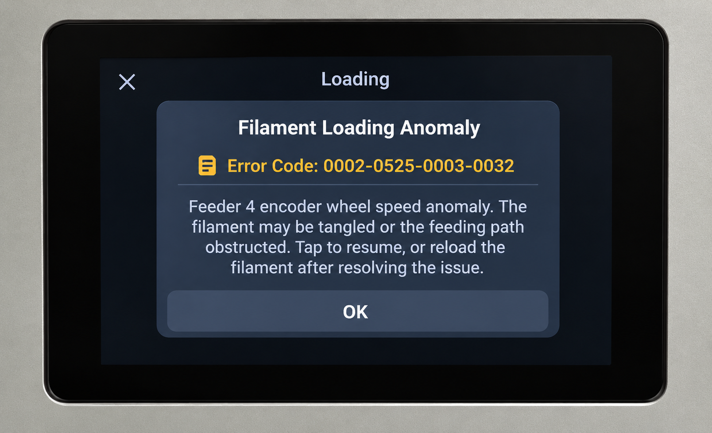

# Snapmaker U1 PopStation Feeder Fix

Unofficial workaround and technical documentation for a reproducible feeder preload failure observed on the Snapmaker U1 after updating to firmware 1.6.

## The Problem

After updating the Snapmaker U1 firmware, some third-party filament feeding systems such as the BIQU PopStation Mini may trigger a **Feeder Encoder Wheel Speed Anomaly** during filament loading.

**Example error:** `0002-0525-0003-0032`

The printer may report that the filament is tangled or the feeding path is obstructed even when the filament path is clear. This project documents the workaround and calibration changes used to restore reliable filament loading.

During filament preload, feeder wheel or motor pulse counts can continue increasing while the calculated RPM reports `0`. The stock preload validation can interpret this as a speed abnormality and raise preload exceptions.

Observed errors include:

- Code 12: `preload fail: wheel_speed`
- Code 11: `preload fail: motor_speed`

The behavior was reproduced on extruders 0, 1, 2, and 3 and was also observed with feeders connected directly to the U1, so the PopStation Mini was not isolated as the sole cause.

## Environment Tested

- Printer: Snapmaker U1
- Firmware: 1.6
- Accessory: BIQU/BIGTREETECH PopStation Mini
- Channels: Extruder 0, 1, 2, and 3

## Working Workaround

The tested workaround has three parts:

1. Bypass the wheel-RPM/slip comparison during preload in `/home/lava/klipper/klippy/extras/filament_feed.py`.
2. Use motor-count feedback as a fallback for preload distance.
3. Calibrate the PopStation filament path with `preload_length: 1900` for both left and right filament feeds.

See [INSTALL.md](INSTALL.md) before changing the printer.

## Tested Result

After the workaround:

- All four feeder channels were tested multiple times.
- All four feeders staged filament consistently just before the toolhead.
- False `Speed Abnormality` / `wheel_speed` failures stopped during normal preload.
- Filament did not overfeed or slam into the toolhead.
- `pulse_counter.py` was restored to stock.
- Motor-speed monitoring, filament detection, timeout, and preload-distance protections remained active.
- Only the wheel RPM/slip validation during preload was intentionally bypassed.

## 🖨️ Support the Project

If this project helped you and you'd like to support continued U1 development, testing, and future projects:

Thank you! 🖨️

## Important Warning

This is an **unofficial workaround**, not an official Snapmaker patch. It modifies firmware-side Python logic. Back up every original file before editing it. A Snapmaker firmware update may replace the modified file or configuration.

The `1900` preload length is a calibration that worked with the tested PopStation setup. Do not assume it is correct for every filament path. Verify feeder travel on your own machine and avoid allowing filament to drive hard into the toolhead.

## Suspected Firmware Issue

The strongest evidence is that pulse counts increase while calculated RPM can become zero. Areas for upstream investigation include frequency-counter timing, `count_time` handling, cases where `delta_time <= 0` forces frequency to zero, and interaction between preload polling and tachometer sampling/report intervals.

See [SNAPMAKER_REPORT.md](SNAPMAKER_REPORT.md) for the technical report.

## License

This project's original code, modifications, and technical documentation
are licensed under the **GNU General Public License v3.0 (GPL-3.0)**.

This project documents modifications to software used by the Snapmaker U1.
Snapmaker's U1 Klipper repository is also distributed under GPL-3.0.

Snapmaker firmware, trademarks, and other third-party components remain
the property of their respective copyright holders and are subject to
their respective licenses. No Snapmaker firmware is distributed by this
repository.

Earlier versions of this project were made available under their previous
licensing terms. Rights already granted under those earlier terms are
unaffected by this change.
